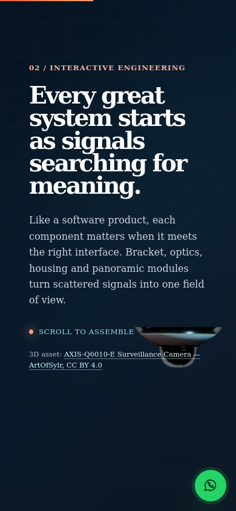
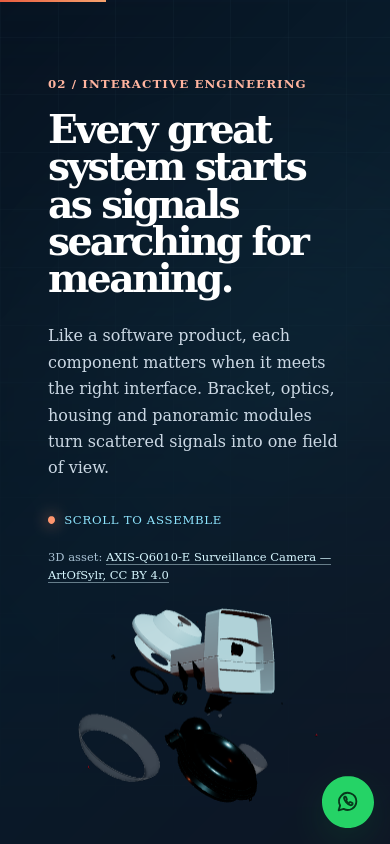
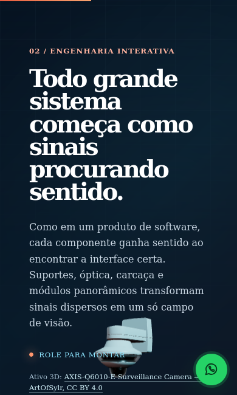

# Auditoria da câmera 3D — 9 de setembro de 2026

## Atualização corretiva

Após a apuração abaixo, a implementação local foi corrigida sem remover ou
substituir nenhuma peça. O canvas deixou de usar recorte; texto e câmera foram
separados em áreas de layout; e a distância da câmera passou a ser calculada a
partir dos limites transformados das 28 meshes em vez de deslocamentos por
breakpoint.

A exportação isolada de produção passou em 11 dimensões no Firefox, com quatro
fases da montagem e 16 ângulos por fase: 28 meshes, nenhum vértice projetado
fora do quadro, `clip-path: none`, nenhuma sobreposição entre cópia e canvas e
canvas contido na janela. A suíte E2E em Chromium desktop/mobile/tablet e
Firefox estreito terminou com 16 testes aprovados e 4 skips intencionais por
projeto. Esta atualização valida o artefato local; a seção **Conclusão** abaixo
registra o estado da produção antes do novo commit, ainda pendente de
verificação pública neste ponto do histórico.

## Conclusão

**O site publicado ainda esconde a parte superior da câmera por CSS.** Em uma
sessão nova do Firefox, a página do Vercel aplicou ao canvas
`clip-path: inset(64% 0 0)`. Isso recorta os 64% superiores da imagem já
renderizada. Em uma janela de 390 × 844 pixels CSS, são aproximadamente
540 pixels escondidos. Nenhuma peça precisa ser apagada do modelo para produzir
esse resultado.

Há um segundo problema: o conjunto está deslocado para a direita na versão
publicada. A medição dos vértices encontrou partes fora do campo de visão
horizontal, inclusive parte de `Base_31` no estado próximo de montado.

A cópia local contém alterações posteriores ao último commit: remove o
`clip-path`, reduz a altura do canvas e muda os parâmetros do modelo. Essa
diferença explica por que desenvolvimento e produção não se comportam da mesma
forma. **A cópia local também não está totalmente aprovada:** ainda apresenta
sobreposição em telas baixas e cortes em tablet. Esta auditoria não alterou o
componente nem publicou uma correção.

## Contexto fornecido por Josué

- Endereço: <https://curriculum-vitae-virid.vercel.app/>.
- Problema observado no Firefox de um Motorola G17 com Android.
- Também observado na produção pelo Dell com Linux Mint, mas não no
  desenvolvimento.
- A versão e a largura efetiva do Firefox Android não foram informadas. Os
  viewports desta auditoria são amostras; não representam medição do Motorola.

O recorte responde à **largura da janela**, e não ao nome do dispositivo.
Ele está dentro de `@media (max-width: 44rem)`, aproximadamente 704 pixels CSS
com a referência padrão de 16px. Um painel estreito no computador também ativa
essa regra. Reproduzimos o recorte em 680 × 900 e não o encontramos em
1440 × 900. A largura exata da janela do usuário permanece desconhecida.

## Versões e método

- Branch local: `main`; HEAD: `23f865f9c877fb3a717e370104c29b53ad221c95`.
- O componente e o CSS da câmera estavam modificados e **não commitados** antes
  desta auditoria. O hash/commit exato do deployment do Vercel não foi consultado
  na conta: identificamos o comportamento pelos arquivos efetivamente servidos.
- SHA-256 do TSX local:
  `46fc26ad2150944a240ad156bca98e3791a6d0f19dfa19e4315631329090061d`.
- SHA-256 do CSS local:
  `ad427605b9821117573e0f9f112d88eea85e3d6c3dd554d38b1f46d783a510b0`.
- Criada uma cópia em `/tmp/curriculum-camera-audit.gEQ81q`; o build Webpack
  terminou com código zero e exportou `out/`. O servidor de desenvolvimento
  ativo não foi reiniciado nem seu diretório de build usado para essa exportação.
- Firefox automatizado: 153.0 (Playwright). Firefox instalado no sistema:
  155.0.1. O perfil pessoal e as configurações do navegador instalado não foram
  alterados. O runtime de teste foi instalado no cache do Playwright.
- Chromium automatizado: versão registrada em `evidence/measurements.json`.
  Todos os testes usam Linux e dimensões de janela simuladas, não Android real.
- O script usa o hook de ferramentas de desenvolvimento do Three.js para observar
  a cena e a câmera usadas no render. Cada chamada original continua executando.
  Registra 28 meshes, projeção de seus vértices, dimensões CSS, erros e screenshots.
- Foram amostrados início, meio, aproximadamente 99,5% da rolagem e retorno ao
  início. A rotação contínua permanece ativa; ângulos e contagens podem variar
  entre execuções. Não foi feita varredura exaustiva de todas as rotações.

## Fatos confirmados

| Verificação | Evidência | Consequência |
| --- | --- | --- |
| GLB íntegro | Local e Vercel: 1.422.588 bytes, 28 meshes, mesmo SHA-256 | Não houve remoção de geometria do arquivo |
| Recorte na produção | CSS calculado no Firefox: `inset(64% 0px 0px)` em 390px e 680px | A parte superior é escondida mesmo quando renderiza corretamente |
| Deslocamento em produção | Posição X do modelo ≈ 0,899 em 390px; vértices fora da borda direita | Remover apenas o recorte não garante enquadramento completo |
| Produção larga | Firefox 1440 × 900: `clip-path: none`; sem vértices fora da imagem nos quatro instantes amostrados | A janela larga não reproduziu o mesmo corte |
| Local em 390 × 844 | Firefox e Chromium: `clip-path: none`; 28 meshes, sem vértices fora do canvas nos quatro instantes | As alterações locais melhoraram esse caso, mas não estão no Vercel |
| Local em 390 × 650, PT | Firefox: seção/canvas chegam a ≈699px numa janela de 650px; sobreposição visível com texto/crédito | Fixar a altura em 43% não reserva uma área exclusiva em todas as telas |
| Local em 834 × 1194 | Firefox: 7 meshes com vértices fora do canvas no primeiro instante e 6 no retorno | O tablet continua precisando de enquadramento adequado |
| Local em 1440 × 900 | No retry do Chromium, `housing003_9` teve vértices fora do canvas em dois instantes | Um ângulo aprovado no desktop não garante a rotação completa |
| Critério diferente entre CSS e JS | CSS até 44rem; JS usa `<640` para centralização/escala | Entre 640 e aproximadamente 704px, layout inferior e deslocamento lateral são combinados |
| Resize parcial | Distância/aspecto atualizam no resize; escala, X e dispersão são escolhidos no carregamento | Rotacionar o aparelho pode manter parâmetros do layout anterior; falta teste específico |
| Testes anteriores insuficientes | `tests/e2e` verifica títulos, links e canvas escondido com redução de movimento | Passar nesses testes não demonstra integridade visual da câmera |

SHA-256 do GLB, igual à procedência registrada em `docs/assets.md`:
`9742eab1461de3d9b6ee6c2af448dbcf1e8bc37fcbf4c3abd0948e02b70cfe5e`.

CSS entregue dinamicamente pela produção durante a auditoria:
[`3evqf8c15fa3r.css`](https://curriculum-vitae-virid.vercel.app/_next/static/chunks/3evqf8c15fa3r.css).
O nome desse arquivo pode mudar no próximo deployment. O fato de ele ser
carregado junto ao componente dinâmico explica por que olhar apenas os primeiros
CSS do HTML não basta.

```css
@media (max-width: 44rem) {
  .AssemblyExperience-module__DmL-JG__canvas {
    clip-path: inset(64% 0 0);
  }
}
```

## Evidência visual

Produção, Firefox, 390 × 844, próximo de montado: a borda superior do objeto
coincide com o início do recorte, perto de y=540px.



Cópia local, Firefox, 390 × 844, estado inicial: a geometria reaparece.



Cópia local, Firefox, 390 × 650, português: a imagem e o texto ainda se
sobrepõem. Este caso impede declarar a correção visual concluída.



## Como você pode conferir

1. Abra produção e desenvolvimento em abas separadas, com a mesma largura,
   idioma, zoom e preferência de redução de movimento.
2. No Firefox do computador, use `Ctrl+Shift+M` e selecione largura 390px.
   Role até a seção 02; aguarde o modelo carregar.
3. No Console das ferramentas de desenvolvimento, execute:

```js
const c = document.querySelector('[aria-labelledby="assembly-title"] canvas');
({
  url: location.href,
  larguraDaJanela: innerWidth,
  recorte: c && getComputedStyle(c).clipPath,
  canvas: c && c.getBoundingClientRect().toJSON(),
  reducaoDeMovimento: matchMedia('(prefers-reduced-motion: reduce)').matches
});
```

Na produção auditada, `recorte` retornou `inset(64% 0px 0px)`; na cópia local,
`none`. Uma comparação temporária pelo Inspetor pode desmarcar `clip-path`
apenas naquela aba. Isso evidencia o recorte, mas não corrige o código nem o
deslocamento lateral. Recarregar restaura o CSS do servidor.

4. Compare 390, 680 e 1440px. Não compare o site local largo com a produção num
   painel estreito, pois isso mistura diferença de versão com diferença de layout.
5. Registre URL, largura/altura, idioma e screenshot. No Motorola, confirme o
   resultado após o deployment corrigido; não é necessário trocar o modelo 3D.

## Reproduzir a auditoria automatizada

Execute na raiz do projeto com as dependências já instaladas:

```bash
node node_modules/playwright/cli.js install firefox
node scripts/audit-camera.mjs --url=https://curriculum-vitae-virid.vercel.app/ --browser=firefox --case=phone --output=test-results/camera-audit/recheck-production
node scripts/audit-camera.mjs --static-dir=/tmp/curriculum-camera-audit.gEQ81q/out --browser=firefox --output=test-results/camera-audit/recheck-local
```

Se a pasta temporária não existir mais, gere uma nova exportação de uma cópia
isolada e passe o seu diretório exportado em `--static-dir`. O script inicia e
encerra seu próprio servidor em uma porta livre. Não reutiliza `out/` antigo
nem confunde a exportação testada com o `npm run dev` ativo.

O script está em [scripts/audit-camera.mjs](../../../scripts/audit-camera.mjs).
Medições resumidas e hashes estão em [evidence/measurements.json](evidence/measurements.json).
Relatórios completos e demais imagens desta sessão estão em
`test-results/camera-audit/` (ignorados pelo Git; podem ser apagados por outros
testes). As três imagens acima e o resumo foram preservados junto deste documento.

## Limites e correção dos registros anteriores

- Não atribuímos o defeito a driver, GPU, Firefox Android ou peças apagadas.
  O recorte foi reproduzido com download novo dos arquivos do Vercel.
- Estar dentro do canvas não significa que uma peça esteja visível: outra peça,
  texto, recorte CSS ou o limite da própria janela pode cobri-la. Os números de
  projeção não medem oclusão nem garantem desempenho.
- Houve timeout de screenshot no Chromium para desktop e tablet na primeira
  rodada. Isso não é um teste aprovado nem prova de falha do site. O relatório
  distingue esses casos das medições concluídas. O retry de desktop terminou
  com quatro capturas e revelou o corte descrito na tabela; tablet Chromium
  permanece sem validação completa nesta auditoria.
- A conclusão anterior de que a câmera estava integralmente aprovada foi
  prematura. As tarefas #6 e #7 continuam em aberto pelos critérios visuais,
  além do teste físico no Motorola/tablet.
- O navegador do painel integrado foi aberto no endereço de produção; esse
  painel não equivale a testar o Firefox Android do Motorola.

O plano de ação está em [PLANO-DE-ACAO.md](PLANO-DE-ACAO.md).

## Referências técnicas

- A projeção depende da proporção do canvas e do campo de visão; alterar essas
  propriedades exige atualizar a matriz de projeção:
  [Three.js — PerspectiveCamera](https://threejs.org/docs/pages/PerspectiveCamera.html).
- O volume das peças pode ser medido incluindo transformações dos descendentes:
  [Three.js — Box3](https://threejs.org/docs/pages/Box3.html).
- A fixação da seção e sua atualização ao mudar o layout fazem parte da
  configuração da rolagem:
  [GSAP — ScrollTrigger](https://gsap.com/docs/v3/Plugins/ScrollTrigger/).
